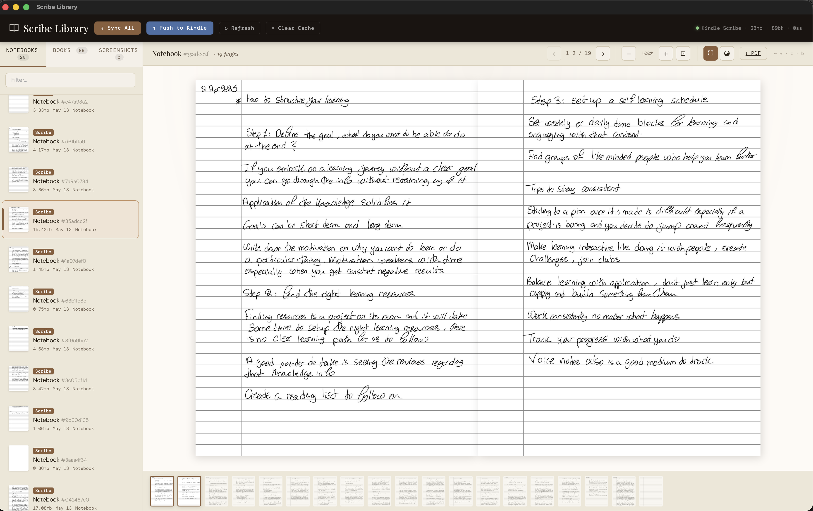

# Scribe Library

A local server for browsing your Kindle Scribe — handwritten notebooks **and**
books (purchased, sideloaded, PDFs) — all offline, with end-to-end decoding
and a USB push-to-Kindle workflow.



## Features

- **Notebooks tab** — KDF-decoded handwritten notebooks rendered as PDFs
- **Books tab** — purchased KFX/AZW3, sideloaded PDFs/EPUBs/MOBIs, all readable in-browser
- **Screenshots tab** — every screenshot from the device's root, in a grid of thumbnails; click to expand, delete to remove from both local library and the Kindle itself
- **In-browser reading for everything** — PDFs, EPUBs, and most KFX/AZW3 books render to nice typography via WeasyPrint; KFX comics render via the image-book path
- **Zen mode** (`z`) — hide everything except the page; floating controls fade in on hover, fade out after 2s
- **Book mode** (`b`) — two-page spread with a 3D page-flip animation; cover-on-right for books, paired-from-start for notebooks
- **Push to Kindle** — drag-and-drop to upload PDFs (or .epub/.mobi/.txt/.docx/.rtf) to your Kindle's `documents/` folder via USB MTP
- **Sync All** — pulls notebooks, books, AND screenshots from the device in one click
- **Smart classification** — purchased vs sideloaded auto-detected by ASIN-shaped filenames
- **Cover fallback** — books without metadata covers use the rendered first page as a thumbnail
- **Multi-page reader** — zoom (`+`/`-`/`0`), keyboard nav (`←`/`→`), thumbnail strip

## Local layout

The library lives **inside this folder** so it's easy to find, back up, or move:

```
scribe_reader/
├── server.py              # The app
├── library/               # ← Your synced content lives here
│   ├── notebooks/
│   │   ├── <UUID>.nbk     # handwritten notebooks
│   │   └── <UUID>.png     # thumbnails
│   └── books/
│       ├── purchased/     # B07XYZ1234_EBOK.kfx etc.
│       ├── sideloaded/    # My Book.pdf, my-book.epub
│       └── meta.json
├── kfxlib/                # vendored KFX decoder
└── ...
```

If you ran an older version of this app, your previous library at
`~/.scribe_library/` or `~/.scribe_notebooks/` is automatically migrated
into the new location on first run.

You can override the location with `--library /some/other/path`.

## Setup

### 1. System dependencies

```bash
brew install cairo libusb pango              # macOS
sudo apt install libcairo2 libusb-1.0-0 libpango-1.0-0  # Debian/Ubuntu
```

(Pango is needed by WeasyPrint for text rendering.)

### 2. Python dependencies

```bash
pip3 install -r requirements.txt
```

### 3. Plug in your Kindle Scribe and unlock the screen

MTP only works while the device is unlocked.

## Usage

```bash
python3 server.py --sync          # full sync, then serve
python3 server.py --sync-books    # only books
python3 server.py --sync-notebooks # only notebooks
python3 server.py                 # serve what's already synced (no MTP)
```

Open <http://127.0.0.1:7070>.

## What works and what doesn't

| Format            | Sync from Kindle | Browse in UI         | Read in UI            | Push to Kindle |
|-------------------|------------------|----------------------|-----------------------|----------------|
| `.nbk` notebook   | ✓                | ✓                    | ✓ (full handwriting)  | n/a            |
| `.pdf` sideloaded | ✓                | ✓                    | ✓ (paged or iframe)   | ✓              |
| `.kfx` text book  | ✓                | ✓ (metadata + cover) | ✓ (rendered via WeasyPrint) | n/a       |
| `.kfx` comic/manga | ✓               | ✓                    | ✓ (rasterized images) | n/a            |
| `.azw3`           | ✓                | ✓ (metadata)         | ✓ (rendered via WeasyPrint) | ✓         |
| `.epub`           | ✓                | ✓ (metadata + cover) | ✓ (rendered via WeasyPrint) | ✓         |
| `.mobi`           | ✓                | ✓                    | ✗ (download only — no MOBI parser) | ✓ |
| Screenshots (PNG) | ✓                | ✓ (grid view)        | ✓ (lightbox)          | n/a            |

## Known limitations

- **PDF annotation overlay is best-effort.** When you write notes on a PDF on your Scribe, the strokes are stored in a `documents/<basename>.sdr/` sidecar folder on the device. We pull the sidecar during sync and try to decode + overlay the strokes onto the PDF when you open it. The KDF/SQLite blob format inside `.sdr/` has varied across firmware versions, so decoding may fail on yours — in which case the PDF still opens normally, and the reader's toolbar shows an amber "annotations not decoded" pill that you can click for diagnostics. If decoding succeeds, you'll see a green "N annotated pages" pill and your strokes will appear over the PDF page content.
- **Pushed PDFs may take a few minutes to appear on the Kindle home screen** (Kindle re-indexing). The file IS on the device immediately — you'll see it in the next sync. A reboot forces re-index.
- **DRM-protected purchased books** that you haven't read recently may decode to empty. The plugin removes light DRM but not all variants.

## File layout

```
scribe_reader/
├── server.py              # Flask app + UI
├── library.py             # Library discovery, classification, metadata cache
├── nbk_to_pdf.py          # Notebook (KDF) → PDF
├── kfx_to_pdf.py          # Book metadata + KFX/EPUB → PDF
├── mtp_sync.py            # USB MTP transport (sync + push + delete)
├── pdf_annotations.py     # PDF annotation overlay (experimental)
├── inspect_sdr.py         # Diagnostic: dump .sdr/ folder contents
├── kfxlib/                # Vendored KFX Input plugin (GPL v3)
├── library/               # ← Your synced content (created on first run)
├── requirements.txt
└── README.md
```

## PDF annotations (experimental)

When you write notes on a sideloaded PDF on the Scribe, the strokes are stored
in a sibling `<basename>.sdr/` folder on the device. `pdf_annotations.py` is a
first attempt at decoding these strokes and overlaying them on the PDF when
you open it in this app.

**Status:** speculative — the decoder hasn't been validated against a real
`.sdr/` folder from the wild yet. The format varies across firmware versions,
so on yours it may work, partially work, or fail entirely.

**To validate against your device:**

```bash
python3 inspect_sdr.py
```

This will find a PDF on your Kindle that has annotations, pull the `.sdr/`
folder contents to `./sdr_inspection/`, and write a Markdown report at
`./sdr_report.md` describing what's in there. Share that report with the
maintainer (or read it yourself) to figure out whether `pdf_annotations.py`
needs adjustment.

## Troubleshooting

**Sync finds nothing** — Kindle isn't unlocked, or the cable doesn't carry data. Try `python3 mtp_sync.py --detect --verbose`.

**A notebook fails with "Could not decode"** — open the server console for kfxlib's error messages. Newer firmware can introduce stroke types the plugin hasn't seen yet.

**A KFX book opens with "Download only"** — this happens when both the image-book path and the text-book path failed. The most common causes: the book has DRM that the plugin can't strip, or kfxlib doesn't recognize a structural element. Check the server console for the exact kfxlib error.

**Pushed PDF doesn't appear on Kindle home screen** — wait a couple minutes, or reboot the Kindle. Verify it's there by re-running sync.

**"Converter not ready" banner** — `cairosvg` or `lxml` or system `libcairo` isn't installed. The status JSON at `/api/status` has the exact message.

**"WeasyPrint not installed" in book reader** — install it: `pip3 install weasyprint`. Without it, text-format books fall back to download-only.

## License

`kfxlib/` is GPL v3 by John Howell (jhowell), copied from
[kluyg/calibre-kfx-input](https://github.com/kluyg/calibre-kfx-input).
The rest of this project is GPL v3 because it links against that library.
